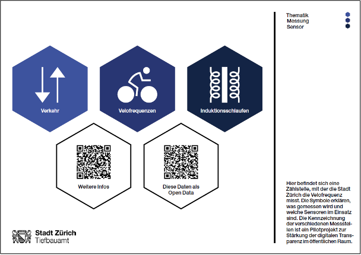
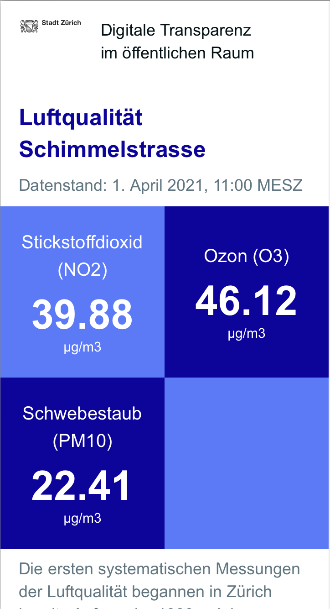
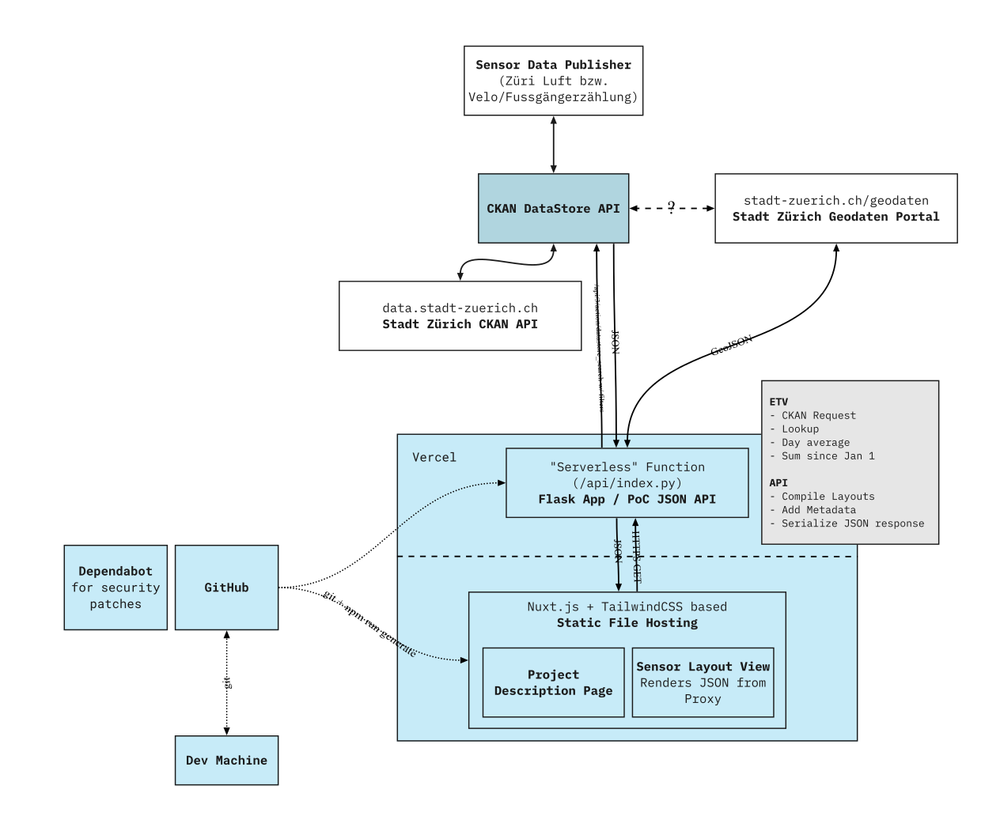

# Pilot Digitale Transparenz im öffentlichen Raum

Daten spielen eine wichtige Rolle in der «Smart City Zürich». Dank ihnen kann beispielsweise die städtische Infrastruktur gezielt und effizient geplant und unterhalten werden. Mittels Sensoren, welche Fahrradfrequenzen, Luftqualität und anderes messen, werden Daten im öffentlichen Raum erhoben.

Mit zunehmender Datensammlung steigt die Bedeutung von Transparenz und Rechenschaftspflicht gegenüber der Öffentlichkeit. Die Stadt Zürich ist diesbezüglich bereits heute aktiv, indem sie viele Daten als «Open Data» veröffentlicht. In diesem Pilotprojekt von Smart City Zürich soll getestet werden, wie zusätzliche Transparenz geschaffen werden kann.

Eine einfache Bildsprache informiert hierbei transparent über die Sammlung von Daten im öffentlichen Raum und deren Verwendung. Sensoren werden mit Piktogrammen und QR-Codes beschriftet. Letztere leiten auf Websites weiter, welche die gesammelten Daten visualisieren und weitere Informationen bieten. Dazu werden ausschliesslich Daten von bereits vorhandenen Sensoren und offenen, frei zugänglichen Behördendaten («[Open Data](https://www.stadt-zuerich.ch/opendata.secure.html)») verwendet.



- [Projektseite](https://transparenzrh.vercel.app)
  - Beispielsensor [Luftqualität Schimmelstrasse](https://transparenzrh.vercel.app/view/air/Zch_Schimmelstrasse) (`/view/air/Zch_Schimmelstrasse`)
  - API-Proxy [Luftqualität Schimmelstrasse](https://transparenzrh.vercel.app/api/v1/air/Zch_Schimmelstrasse) (`/api/v1/air/Zch_Schimmelstrasse`)
- [Python Notebook](https://github.com/Brieden/mixed/blob/main/stick-it-open.ipynb)
- [D3 Notebook](https://observablehq.com/@n0rdlicht/transparenzrh)

## Vorschau



## Developer

### Architecture Proof of Concept



- Frontend
  - SSR via Nuxt.js
  - TailwindCSS
- Backend (see `/api`)
  - Flask based "serverless" function
  - Querying [CKAN DataStore API](https://docs.ckan.org/en/latest/maintaining/datastore.html)

For testing and deployment add the following environment variables:

- `API_URL`

### Main app run and deploy

```bash
# clone repository
git clone git@github.com:cividi/TransparenZRH.git

# install dependencies
npm install

# serve frontend and backend with hot reload at localhost:3000
export API_URL=http://localhost:3000/api/v2/
vercel dev # frontent only: npm run dev

# build for production and launch server
npm run build
npm run start

# generate static project
npm run generate
```

For detailed explanation on how things work, check out [Nuxt.js docs](https://nuxtjs.org).

### Aggregated values cache

Some values are pre aggregated and cached in a S3 bucket as publicly readable files. To populate the cache (for production and testing handled via a [GitHub Action](.github/workflows/update-cache.yml) run 5 min past every hour):

```sh
# Virtual environment and dependencies
python3 -m venv venv
. venv/bin/activate
pip install src/requirements.txt

# Set S3 environment variables
export AWS_ACCESS_KEY_ID=<YOUR_S3_ACCESS_ID>
export AWS_SECRET_ACCESS_LEY=<YOUR_S3_SECRET_ACCESS_LEY>
export S3_ENDPOINT_URL=<YOUR_S3_ENDPOINT>

# Run cache updater
python src/aggregators.py
```

# LICENSE

TransparenZRH
Copyright (C) 2021 cividi GmbH

This program is free software: you can redistribute it and/or modify
it under the terms of the GNU Affero General Public License as published by
the Free Software Foundation, either version 3 of the License, or
(at your option) any later version. See [LICENSE](LICENSE)
